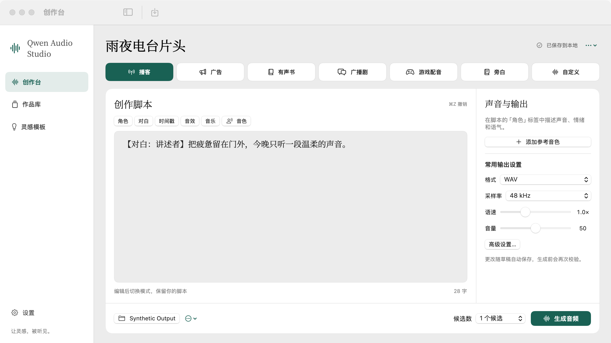

# Qwen Audio Studio for Mac

面向 `qwen-audio-3.1-tts-next` 的 macOS 原生创作台。界面采用 SwiftUI/AppKit，草稿、作品、模板与任务由本机 SQLite 保存，音频播放和参考音色处理使用原生音频模块。运行时无需浏览器、本地 Web 服务、Python、Node 或 ffmpeg；调用百炼生成音频时需要联网，且按服务规则收费。



## 安装与准备

- 支持 macOS 14 或更新版本、Apple Silicon。首版尚未验证 Intel Mac。
- 从 `dist/Qwen Audio Studio-macOS14-AppleSilicon.dmg` 安装：打开映像，将应用拖到“Applications”。本地版本使用 ad-hoc 签名，尚无 Developer ID 公证，供当前机器本机验收；面向其他用户分发前须另行签名、公证和贴票。
- 在百炼北京地域准备具有 Next 音频服务权限的 [API Key](https://help.aliyun.com/zh/model-studio/get-api-key) 和 [Workspace ID](https://help.aliyun.com/zh/model-studio/obtain-the-app-id-and-workspace-id)。两者在“设置”中分别保存到本机 Keychain；保存后不会向界面回填 API Key。请勿把它们写入脚本、截图或提交到 Git。
- 首次使用，在“设置 → 文件与存储”选择输出文件夹并允许访问。应用会记住安全作用域授权；目录搬迁、磁盘断开或权限失效时，可在原处重新授权。点击 Finder 按钮可定位已登记的目录或作品。

## 创作流程

创作台提供播客、广告、有声书、广播剧、游戏配音、旁白、自定义七种模式。填写脚本、选择格式与采样率，按需添加参考音色并设置 1–3 个候选。提交前会展示编译后的 Prompt、输出位置、参考音色文件和实际调用次数；只有确认后才会发出可能收费的请求。任务状态会保存在本地；提交结果不确定时不会自动重发收费 POST。可重试的下载只复用已取得的下载地址。

参考音色支持 WAV、MP3、M4A、OGG Opus，手动选择不超过 30 秒的片段；可试听源文件和选区，也可选择临时使用或保存到本机音色库。作品库可搜索筛选、试听、下载、查看详情、重命名、收藏、复制 Prompt、继续创作、设置最终版本、同位置 A/B 对比及移入可恢复回收站。模板库提供七类各六个内置场景，支持变量、预览、收藏与自建。

如需迁移网页版数据，在“设置 → 导入旧版作品”中主动选择旧数据目录，先核对预览数量和缺失项，再确认导入。请先退出旧版应用。原有数据按只读方式处理，旧音频在目录之外时需要单独授权；旧输出目录路径不会自动获得新应用权限。迁移后仍要选择原生应用的输出文件夹。

## 开发与本机验证

需要 Xcode Command Line Tools/Swift 6、`hdiutil` 和可用网络来首次构建内置 OGG/Opus 静态库。源码可用 Xcode 打开 `Package.swift`。以下命令在仓库根目录执行：

```sh
zsh scripts/build-app.sh
zsh scripts/build-dmg.sh --app 'dist/Qwen Audio Studio.app' --replace
zsh scripts/test-build-dmg.sh
zsh scripts/verify-dmg-install.sh
swift test --no-parallel --disable-sandbox
```

构建脚本在 `/private/tmp` 暂存和签名 App，再生成含 Applications 快捷方式的 DMG。打包与安装测试会挂载只读映像，严格验签，核对字体、42 个模板、第三方音频许可，并在临时 Applications 目录两次启动隔离合成原生窗口；不会写系统 `/Applications` 或读取真实作品。完整测试与实测边界见 [QA 记录](docs/QA.md)。

## 当前边界

本版自动化使用合成音频和假服务。真实付费 Next 短句调用、实体扬声器听感、完整 VoiceOver 实际朗读及旧版目录选择框的人手交互仍列于 QA 待验项，不能由合成测试替代。界面面板使用原生系统对话框；当前桌面自动化环境中，导入目录面板的有界探针发生超时。签名是 ad-hoc，本机安装验证通过，公开分发需要 Developer ID 公证。应用不提供离线模型、账户同步或自动更新。

第三方 OGG/Opus 许可位于 `ThirdParty/Licenses/`，思源宋体衍生子集许可位于 `Resources/Fonts/OFL.txt`。
