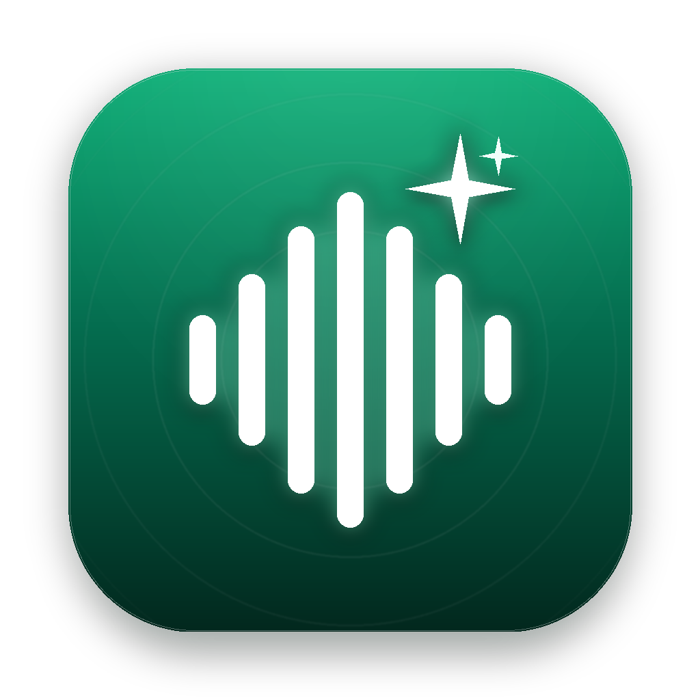
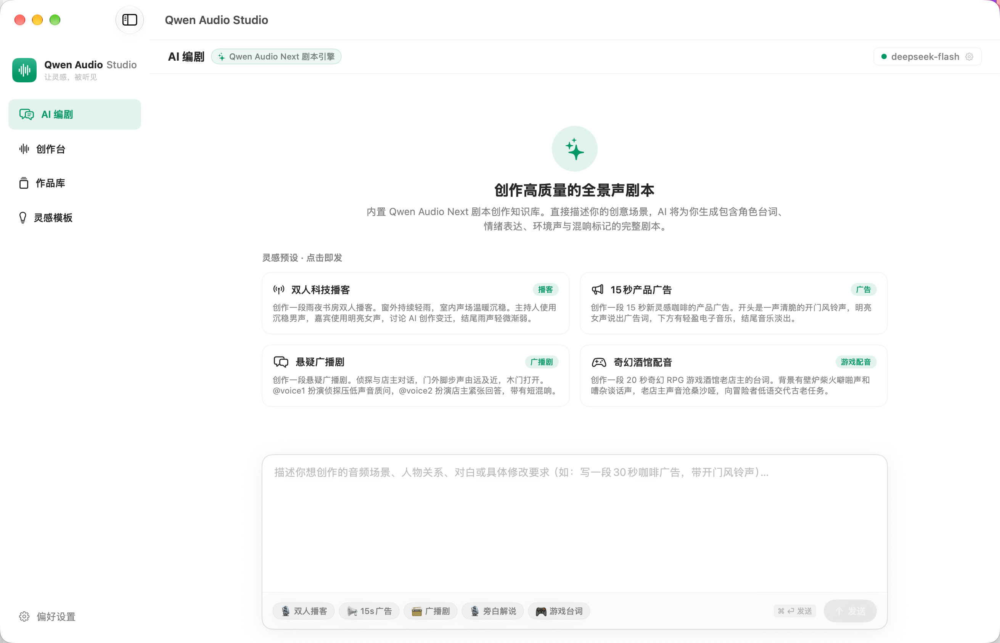
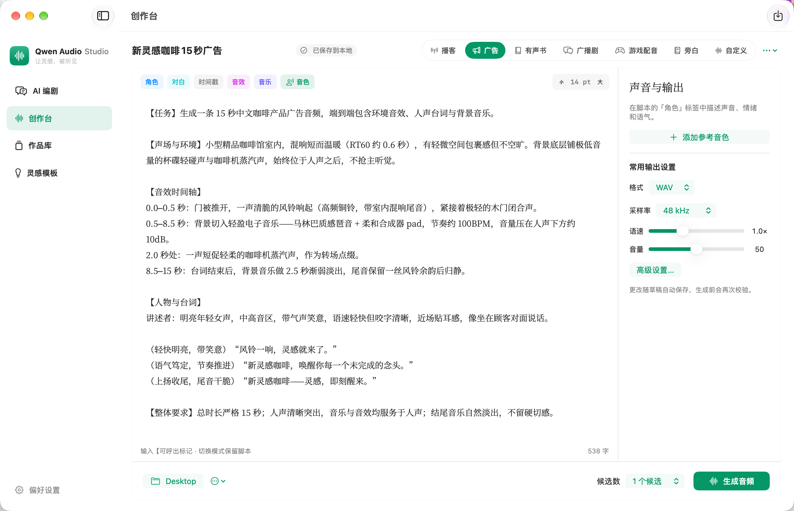

<div align="center">
  
  <h1>Qwen Audio Studio for Mac</h1>
  <p><b>让灵感，被听见</b></p>
  <p>面向 <code>qwen-audio-3.1-tts-next</code> 的 macOS 原生全景声音频创作台与 AI 剧本工坊</p>
</div>

---

## Windows 版

Windows 10/11 x64 桌面版现位于 [`windows/`](windows/README.md)，与本机 macOS 工程和数据独立。提供便携 ZIP、Windows 原生 CI 与完整测试说明；请以对应提交的成功构建为准。

## 界面预览

### 1. AI 编剧（对话式全景声剧本工坊）
> 内置全景声剧本方法论，支持接入任意兼容 OpenAI 规范的大模型，快速构思多角色台词、情绪与音效标签，并一键导入创作台二次微调。



### 2. 原生创作台（多模式声学合成与二次微调）
> 提供 7 种专业场景模式，支持多角色音色分配、情绪与动作指令嵌入、音效提示词与声学环境描述，提交前具备计费预检与确认。



---

## 核心功能

### 1. AI 编剧（对话式脚本工坊）
- **内置大模型对话**：位于侧边栏首位，内置 Qwen Audio Studio 音频指令方法论，专为全景声对话、播客、广播剧、音效标签（如 `[laughter]`、`[sigh]`、`[audio]`）与多角色台词设计。
- **通用模型兼容**：支持任意兼容 OpenAI API 规范的大模型（默认推荐 DeepSeek V3 / Qwen / 通义千问等），可在“设置”中自由配置接口地址（Base URL）、API Key 与模型名称。
- **一键导入创作台**：AI 生成的脚本支持一键直接解析并同步至“创作台”，自动提取角色对话、音色指示与文本内容，方便无缝进入二次微调与试听生成。

### 2. 多模式原生创作台
- 提供 **播客、广告、有声书、广播剧、游戏配音、旁白、自定义** 七种专业场景模式。
- 脚本支持多角色分段、情绪与动作指令嵌入、音效提示词与声学环境描述。
- 参数精细可调：支持 WAV / MP3 / PCM 格式与 16000 / 24000 / 48000 Hz 采样率配置。
- 提交前完整展示编译后的 Prompt、输出目标目录、参考音色文件与计费调用次数确认，避免误触扣费。

### 3. 即刻试听与交付体验
- **4 阶段可视化进度监控**：参数编译准备 → 提交百炼任务 → 异步声学渲染 → 结果下载与入库，进度条实时反馈。
- **弹窗直接试听**：任务完成后弹出的交付卡片内置原生音频试听控件，支持一键播放 / 暂停切换，直接读取本地文件流，无延迟、免去额外转码流程。
- **流式音频动态头兼容**：底层自动兼容百炼 OSS 返回的流式 WAV 动态头部结构，准确获取音频真实物理时长（如 15.0 秒），消除显示为 0 秒或解码失败的情况。
- **在 Finder 中定位**：卡片提供一键直达按钮，方便快速定位最终生成的物理音频文件。

### 4. 私有沙盒凭据安全存储
- 采用应用私有沙盒安全存储（POSIX 0600 权限）与内存安全缓存，妥善保存百炼 API Key、Workspace ID 及 AI 编剧的大模型 Key。
- 彻底消除系统密码弹窗反复阻断任务的问题，提升自动化与创作流畅度。

### 5. 参考音色与作品库管理
- **参考音色**：支持导入 WAV、MP3、M4A、OGG Opus 音频，内置波形裁切与 30 秒选区试听，可临时调用或持久化至本地音色库。
- **作品库**：支持检索筛选、波形查看、多版本无损 A/B 对比播放、导出与可恢复回收站。
- **灵感模板**：内置 42 组覆盖全场景的起手模板，支持自定义变量替换与自建模板。

---

## 侧边栏导航架构

- 💬 **AI 编剧**：灵感构思、多角色剧本生成、一键流转创作台
- 🎙️ **创作台**：角色分配、情绪音效微调、候选版本生成
- 📚 **作品库**：音频资产管理、多版本 A/B 盲测对比
- 💡 **灵感模板**：经典场景模板开箱即用
- ⚙️ **设置**：百炼凭据、AI 编剧大模型配置、存储目录授权

侧边栏底部优雅呈现品牌主旨：`让灵感，被听见`。

---

## 安装与准备

- **运行环境**：支持 macOS 14（Sonoma）或更新版本，针对 Apple Silicon 芯片深度原生优化。
- **安装包**：发布页 DMG 文件位于 `dist/Qwen Audio Studio-macOS14-AppleSilicon.dmg`，打开后将应用拖拽入 `Applications` 即可。
- **配置服务凭据**：
  1. 打开“设置 → 服务连接与凭据”，填入阿里云百炼 [API Key](https://help.aliyun.com/zh/model-studio/get-api-key) 与 [Workspace ID](https://help.aliyun.com/zh/model-studio/obtain-the-app-id-and-workspace-id)。
  2. 在“设置 → AI 编剧大模型配置”中配置用于剧本创作的模型（如 DeepSeek V3 等），填入对应的 API Key 与 Base URL。
  3. 在“文件与存储”中选择并授权本地音频输出目录（例如桌面或自定义工程文件夹）。

---

## 本地开发与构建

需要安装 Xcode Command Line Tools（Swift 6）及 `hdiutil`：

```sh
# 1. 编译并打包原生 macOS App Bundle
zsh scripts/build-app.sh

# 2. 构建 DMG 发布镜像并执行自检
zsh scripts/build-dmg.sh --app 'dist/Qwen Audio Studio.app' --replace
zsh scripts/test-build-dmg.sh
zsh scripts/verify-dmg-install.sh

# 3. 运行核心功能单元测试
swift test --no-parallel --disable-sandbox
```

---

## 许可证说明

- 第三方 OGG/Opus 原生编解码库许可位于 `ThirdParty/Licenses/`。
- 思源宋体衍生子集许可位于 `Resources/Fonts/OFL.txt`。
